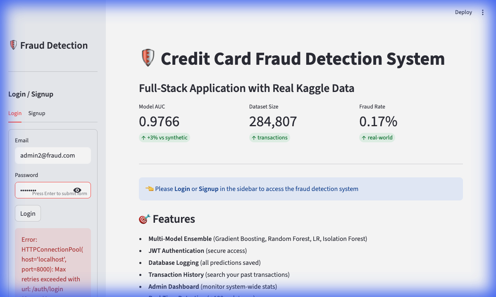

# How to Add UI Screenshots

## Quick Guide

1. **Start the application**
```bash
# Terminal 1: API
python api/app.py

# Terminal 2: Dashboard  
streamlit run dashboard/app.py
```

2. **Open browser**: http://localhost:8501

3. **Capture these screenshots**:

### Screenshot 1: Fraud Detection Page
- Login with: `admin2@fraud.com` / `admin123`
- Go to "🔍 Fraud Detection" tab
- Fill in sample transaction
- **Take screenshot before clicking "Analyze"**
- Save as: `dashboard/assets/ui_fraud_detection.png`

### Screenshot 2: Model Performance  
- Click "📊 Model Performance" tab
- Scroll to show ROC curves and metrics
- **Take screenshot**
- Save as: `dashboard/assets/ui_model_performance.png`

### Screenshot 3: Admin Panel
- Click "⚙️ Admin Panel" tab
- **Take screenshot showing statistics**
- Save as: `dashboard/assets/ui_admin_panel.png`

### Screenshot 4: Login Page (Optional)
- Logout
- Show the login/signup page
- **Take screenshot**
- Save as: `dashboard/assets/ui_login.png`

## Update README

After saving screenshots, update `README.md`:

```markdown
<td width="50%">
  
  <p align="center"><b>Fraud Detection Interface</b></p>
</td>
```

Replace the placeholder text with actual image tags for each screenshot.

## Screenshot Tips

- **Resolution**: Take full-window screenshots (not full desktop)
- **Clean browser**: Hide bookmarks bar, use clean browser session
- **Sample data**: Use realistic transaction amounts (e.g., $500.00, not $0.01)
- **Lighting**: Use light mode if your UI has it (better for README visibility)

## Mac Screenshot Commands

- **Full window**: `Cmd + Shift + 4`, then press `Space`, click window
- **Selection**: `Cmd + Shift + 4`, drag to select area
- **Save to file**: Screenshots save to Desktop by default

## Commit After Adding

```bash
git add dashboard/assets/*.png
git add README.md
git commit -m "Add UI screenshots to README"
git push
```

Your README will now show the complete visual documentation!
